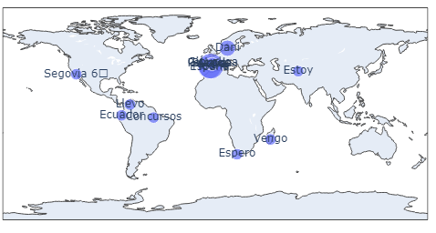

# 📓 **Class Exercise: APIs and Web Scrapping** 🌐

This is a simple example of APIs usage and web scrapping. It's composed of four exercises that approach these themes on different angles: scrapping information from a web store, get place names from a certain subreddit and consulting their positions with an API, building an API REST to get news from _El País_ newsletter on certain topicsa and building an API to censor faces on an image.

---

## 🌐 Web Scraping
The main Python libraries used are:
- **requests:** to download HTML text from an url.
- **bs4 (BeautifulSoup):** to access the HTML.
- **re:** regular expression, to ease the data collection.

## 🤖 APIs:
The main Python libraries used are:
- **json:** to read the APIs' data.
- **hug:** develop APIs.
- **FastAPI:** develop APIs as well.

---

## 🌟 Results

By extracting a subreddit locations written on the first posts, these were found:

It's noticable that some locations are just common words in spanish.

Also, the censored images resulted as follows:

